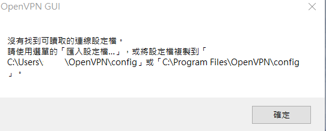
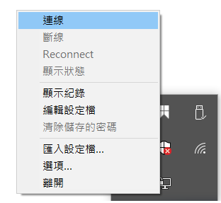
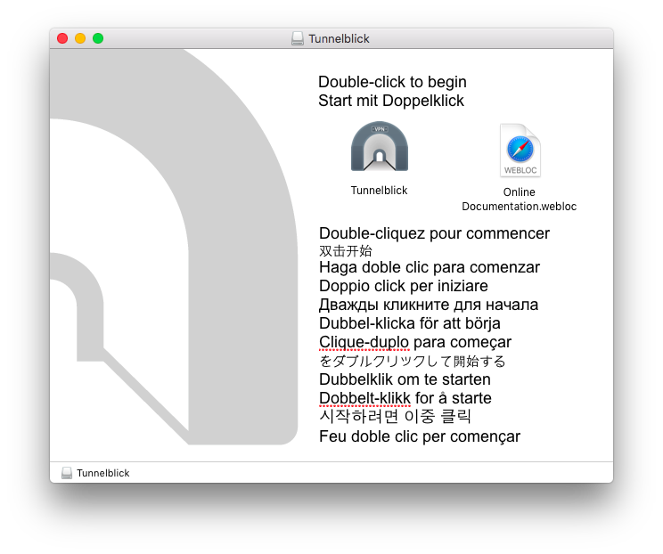
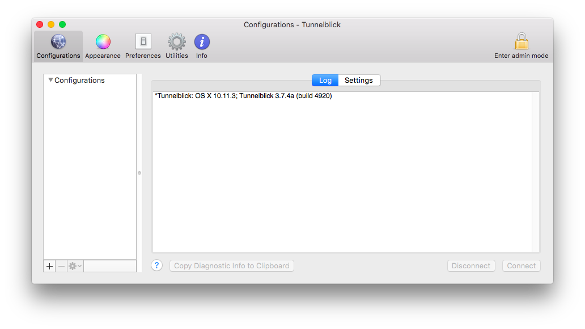
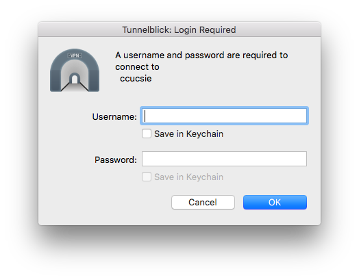
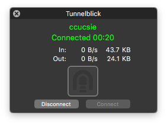

title: VPN 使用手冊
---
## 規範
<blockquote>本系 VPN 服務僅提供系上師生進行相關文獻閱覽或在校相關服務使用

由於服務性質因素，若有同學使用 VPN 進行對外攻擊或是大量下載之相關違規事項

經查詢屬實，將停止同學系上帳號及工作站使用權力，還請同學切勿以身試法。
</blockquote>

## PPTP
<blockquote>由於新版的 iOS 10 和 macOS Sierra 已經移除 PPTP 協定
還請使用該版本以上的同學轉而使用 OpenVPN 的服務
</blockquote>

以下教學以 windows 10 作為範例

0. 前往網際網路設定點選 VPN 選項


1. 點選新增 VPN 連線，輸入如下圖相關資訊


2. 設定完成後，點選頁面下方"變更介面卡設定"


3. 右鍵點擊建立好之 VPN 介面卡, 選擇內容並切換到安全性的分頁


4. 依照下圖紅框指示進行設定，按下確定


5. 選取該設定好之 VPN 連線，輸入系上工作站帳密即可成功連線

## OpenVPN

### Windows

0. 前往 [OpenVPN 官網下載處](https://openvpn.net/index.php/open-source/downloads.html)。 下載對應客戶端並安裝。


1. 前往 [vpn.cs](https://vpn.cs.ccu.edu.tw)。下載 [OpenVPN 設定檔](https://vpn.cs.ccu.edu.tw/clients/ccucsie.ovpn)

2. 執行已安裝完成之 OpenVPN GUI, 此時應會出現要求設定檔之提示



3. 右鍵點擊右下角 OpenVPN GUI 圖示，點選匯入設定檔選項, 選擇並匯入前述下載之設定檔


4. 再次右鍵點擊 OpenVPN GUI 圖示, 點選連線選項



5. 輸入系上工作站帳號密碼登入


6. 當看到訊息 "已連線至 ccucsie", 即表示 VPN 連線已完成


### MacOS

本教學包含兩部分，請依喜好擇一選用。
* [Tunnelblick](#tunnelblick) ...for beginner
* [Terminal](#terminal) ...for advanced user ~~and good CS student~~

#### Tunnelblick

0. 前往 [Tunnelblick 官網](https://tunnelblick.net)。 點擊左側綠色箭號 "Download Latest Stable Release"。


1. 當警示視窗跳出，點擊 "Open"。


2. 打開所下載之 dmg 檔案。雙擊 Tunnelblick 圖示。


3. 輸入 mac 使用者帳號及密碼以允許安裝。


4. 安裝完成後，將 [中正資工 VPN 設定檔](https://vpn.cs.ccu.edu.tw/clients/ccucsie.ovpn) 拖曳到左側 Configuration 欄內。


5. 點選上圖右下方之 "Connect"，或是點選 Spotlight 旁之 Tunnelblick 圖示（如下圖），並點選 "Connect ccucsie"。


6. 以中正資工系工作站帳號及密碼登入。


7. 看到訊息 "ccucsie Connected" 表示 VPN 連線已完成。


#### Terminal

0. 安裝套件管理工具 [Homebrew](https://brew.sh)。
Install package management tool [Homebrew](https://brew.sh).
```
$ /usr/bin/ruby -e "$(curl -fsSL https://raw.githubusercontent.com/Homebrew/install/master/install)"
```
> Q: What does homebrew do?
> A: Homebrew installs the stuff you need that Apple didn’t.[name=#homebrew][color=brown]

1. 以 Homebrew 安裝 OpenVPN。
```
$ brew install openvpn
```

2. 因 `openvpn` 置於 `/usr/local/sbin/` 下，而該路徑原生不在 `PATH` 中，故將下行加入 `~/.bashrc` 中，並重新 `source ~/.bashrc`。
```
export PATH=/usr/local/sbin:$PATH
```

3. 以 `openvpn` 進行連線。（[OpenVPN 設定檔下載](https://vpn.cs.ccu.edu.tw/clients/ccucsie.ovpn)）
```
$ sudo openvpn /path/to/config/ccucsie.ovpn
```


4. 看到訊息 "Initialization Sequence Completed" 表示 VPN 連線已完成。
```
Sun Nov 12 11:17:53 2017 Initialization Sequence Completed
```

5. （選擇性）因密碼可能會快取於記憶體中，請考慮使用參數 `auth-nocache` 以提升安全性。
```
WARNING: this configuration may cache passwords in memory -- use the auth-nocache option to prevent this
```


## Bug Report

若使用上有問題，請聯繫資工系計中信箱。
- [About US](/about/)

<i class="fa fa-edit fa-fw"></i> Last Edited: _2018/10/06 by setsal_, contributed by _silenttulips_
